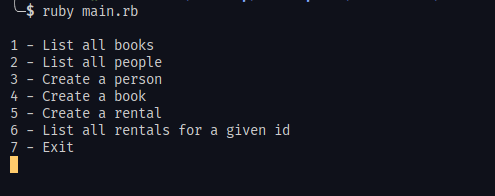

# OOP School Library

> This is a school library app, build using Ruby to practice the Object Orianted Programming. the code includes classes that represent students and teachers

## Getting Started

To start using this software you need to have Ruby installed in your machine

Then clone this repo:

```
-$ git clone https://github.com/Ismailco/OOP-school-library
```

```
-$ cd OOP-school-library
```

To run the script, in your terminal:

```
-$ Ruby main.rb
```

Choose an option:



To close the programe choose 7 then press ```Enter```


## Authors

👤 **Ismail courr**

- GitHub: [@ismailco](https://github.com/ismailco)
- Twitter: [@ismailcourr](https://twitter.com/ismailcourr)
- LinkedIn: [ismailcourr](https://linkedin.com/in/ismailcourr)

## 🤝 Contributing

Contributions, issues, and feature requests are welcome!

Feel free to check the [issues page](../../issues/).

## Show your support

Give a ⭐️ if you like this project!

## 📝 License

This project is [MIT](./LICENSE) licensed.
